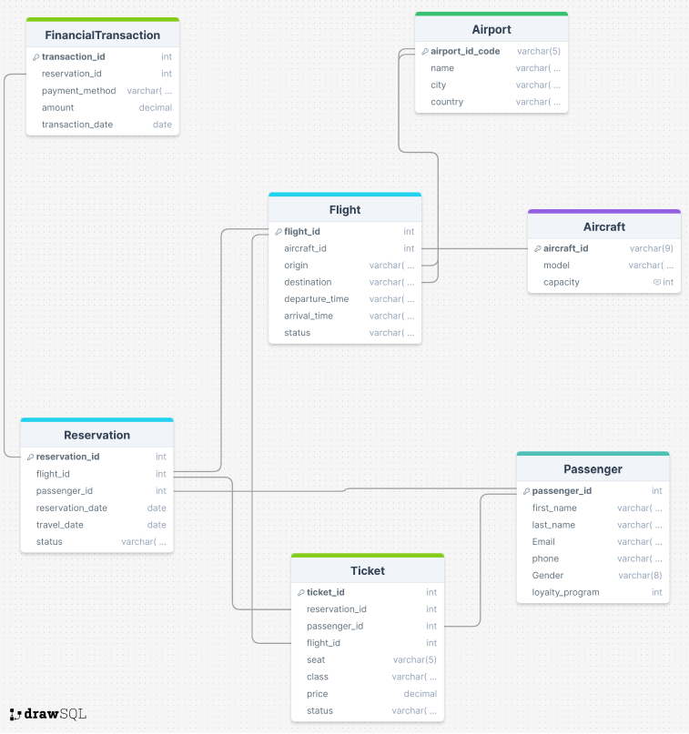

# ✈️ Airlines Database Project (PL/SQL - Oracle)

This project is a **PL/SQL-based airline database** developed in the **Oracle Database Environment**. It includes database schema creation, queries, and functionalities to manage reservations, passengers, flights, tickets, and financial transactions.

## 📌 Features
- **Comprehensive Database Schema**: Covers key entities like flights, reservations, passengers, and transactions.
- **Data Management Functionalities**: Implements procedures, triggers, and functions for seamless data handling.
- **Predefined Queries**: Includes useful queries for retrieving and analyzing airline data.

## 📂 Project Structure

| File Name | Description |
|-----------|------------|
| `AirlinesDatabaseTablesData.sql` | Defines tables and inserts sample data. |
| `AirlinesDatabaseFunctionalities.sql` | Contains stored procedures, triggers, and functions. |
| `AirlinesDatabaseQueries.sql` | Includes various SQL queries to fetch data. |
| `TableConnections.png` | Visual representation of table relationships. |

## 📊 Database Schema

The following diagram illustrates the structure and relationships between different tables:

### Installation
You can simply clone the repository with git clone.
